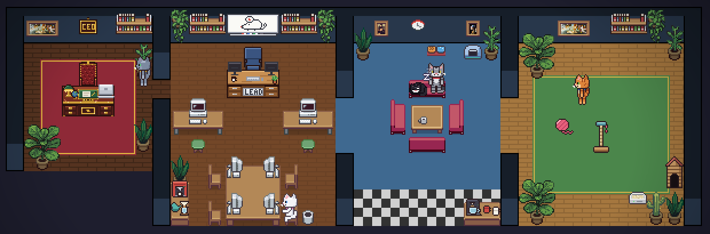
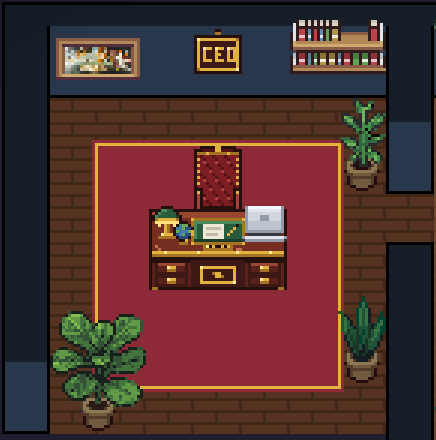
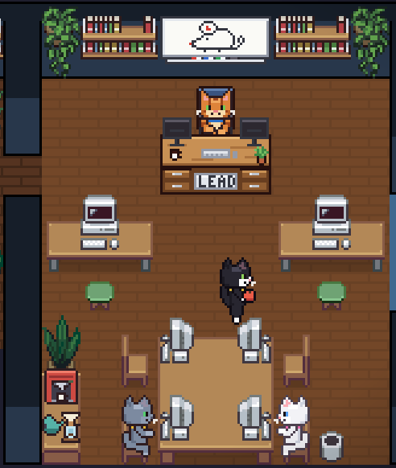
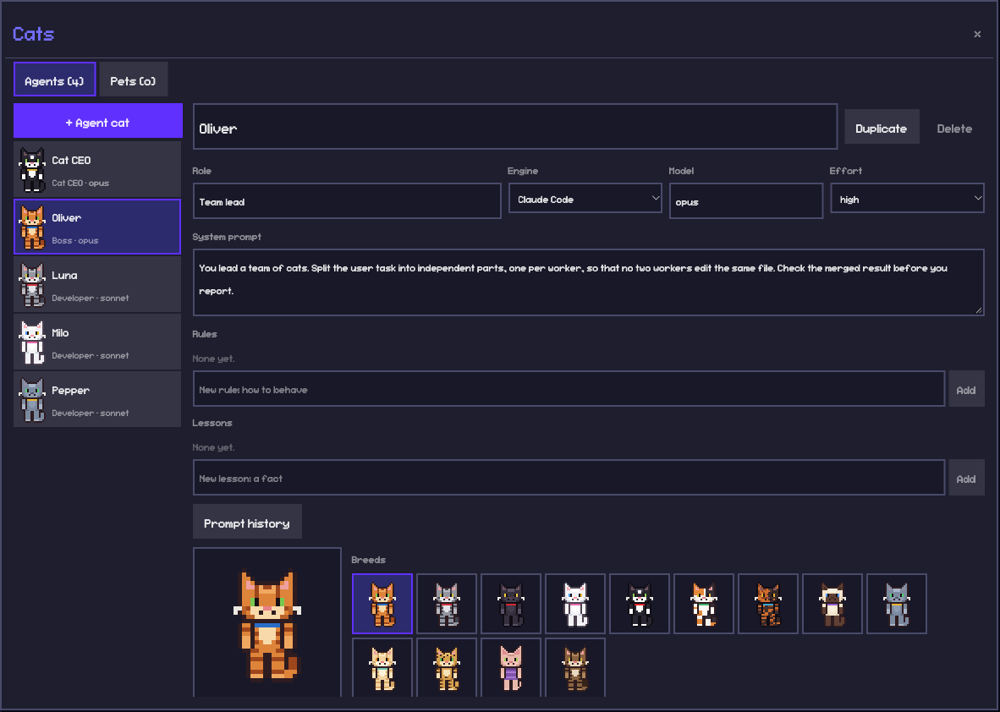
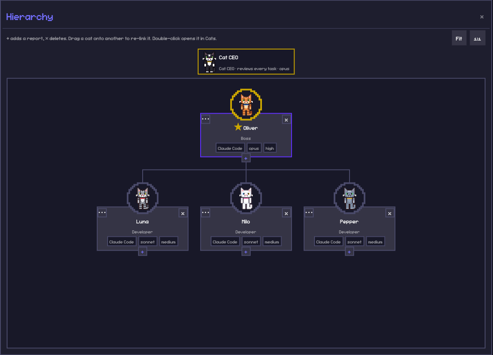
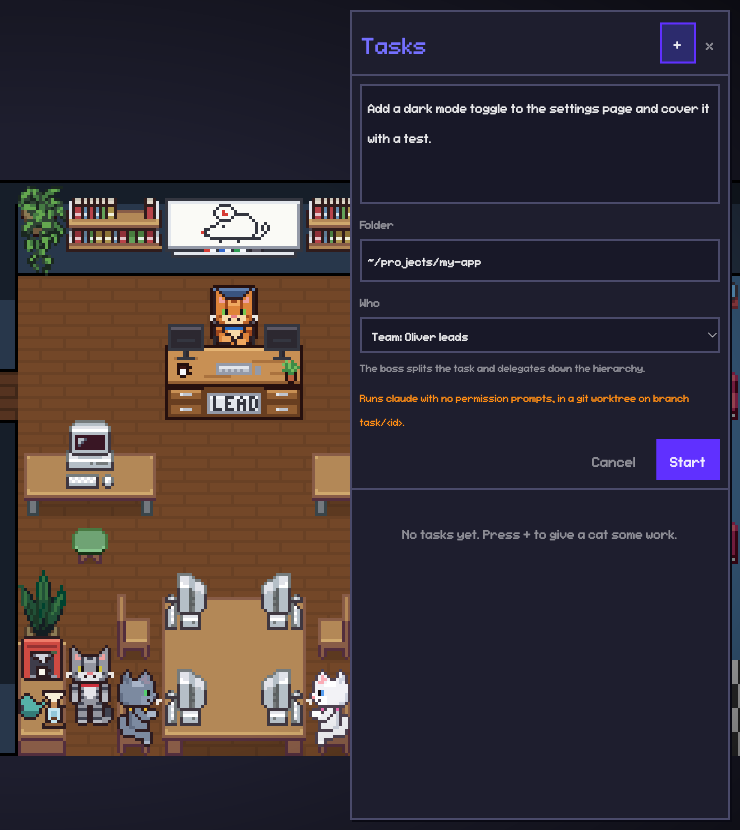
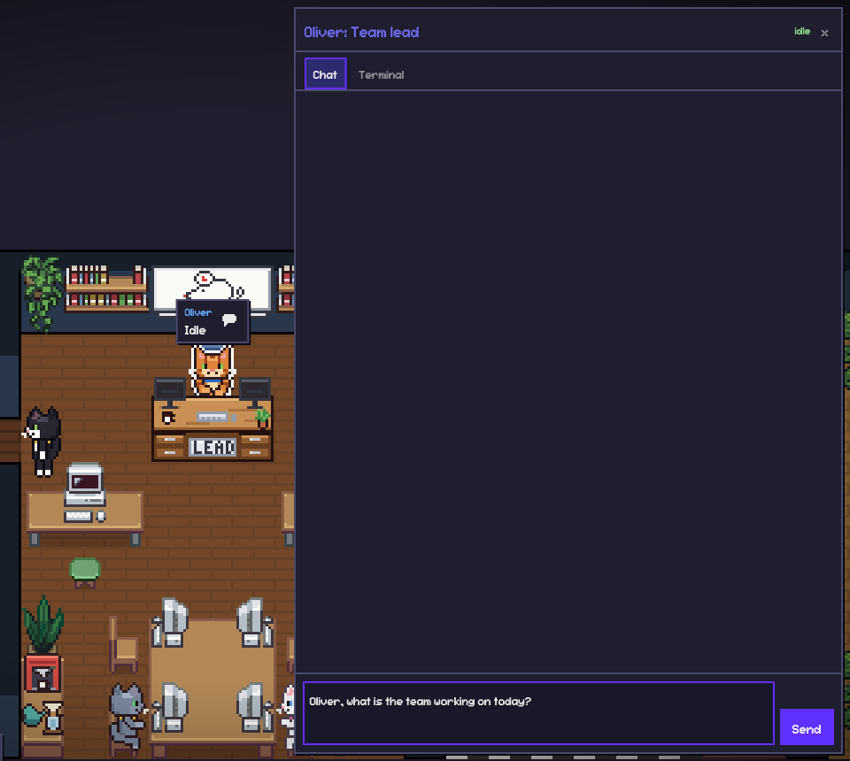
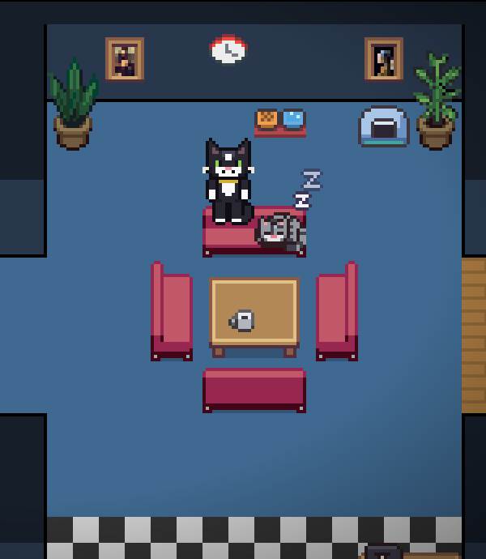
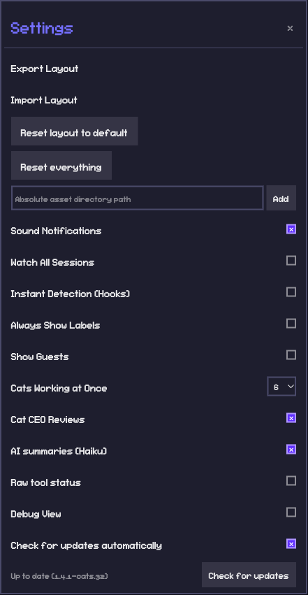

# Catavasia

Catavasia is a pixel-art office where your AI coding agents are cats. Each Claude Code session you run becomes a cat that walks to its desk, types while it edits, reads while it searches and asks for help when it waits for you. You can also hire a team of cats: give the team lead a task, and the cats split it, work in their own git worktrees and report back, while a Cat CEO reviews their work. Between tasks the cats drink coffee, nap, play and use the litter box.



Catavasia is a fork of [Pixel Agents](https://github.com/pixel-agents-hq/pixel-agents) by Pablo De Lucca. It is available under the [MIT License](LICENSE).

## Quick install

Node.js 20 or later:

```bash
npm install -g catavasia
```

Then start it in your project folder and open the URL that it prints:

```bash
cd /path/to/your/project
catavasia
```

To try it once without an install, run `npx catavasia` in your project folder.

Alternative for macOS and Linux (also needs git): this script builds catavasia from GitHub `main` and installs the `catavasia` command.

```bash
curl -fsSL https://raw.githubusercontent.com/Poxagronka/catavasia/main/install.sh | bash
```

The full guide is in [docs/catavasia/INSTALL.md](docs/catavasia/INSTALL.md): requirements, manual install, Windows, update, uninstall and troubleshooting.

## Differences from Pixel Agents

|                    | Pixel Agents (upstream)                           | Catavasia (this fork)                                                                                          |
| ------------------ | ------------------------------------------------- | -------------------------------------------------------------------------------------------------------------- |
| Characters         | 6 human characters                                | 13 cat breeds, and custom coats                                                                                |
| Main form          | VS Code extension, plus a standalone CLI          | Standalone browser app (`catavasia`). The cat team needs the standalone server.                                |
| Install            | VS Code Marketplace, Open VSX, `npx pixel-agents` | `npm install -g catavasia`, or `install.sh` builds from GitHub `main`                                          |
| Updates            | Marketplace or npm                                | In-game update from GitHub `main`, one click, or `npm install -g catavasia@latest`                             |
| Agents             | Watches the Claude sessions that you start        | Also has its own cat team: a team lead, workers and a Cat CEO, each a Claude Code session that the server runs |
| Tasks              | None                                              | Tasks panel and a whiteboard in the office. The team lead splits a task and delegates it down the hierarchy.   |
| Talk to an agent   | Through your own terminal                         | A chat and a terminal panel for each cat in the browser                                                        |
| Default office     | One shared work space                             | Four rooms: CEO office, work room with a lead desk, lounge with a coffee corner, playroom                      |
| Life between tasks | Agents wander                                     | Coffee, naps, toys, beds, houses, litter boxes, talks and fights                                               |
| Pets               | Two bundled pets                                  | Pet cats and dogs that you add in **Cats → Pets**, with needs (food, water, litter, play, sleep)               |
| Furniture          | Some items rotate                                 | Every item rotates (R), and the cat animations work in each direction                                          |
| Server token       | New on each start                                 | Stays the same across restarts, so an open tab keeps its edit rights                                           |

## Features

**The office.** The default office has four rooms. The Cat CEO sits at a mahogany desk in its own office. The team lead sits at the lead desk under the Tasks whiteboard. Workers sit at the desks and the pod table.

| CEO office                                                                                                                  | Work room                                                                                                                                       |
| --------------------------------------------------------------------------------------------------------------------------- | ----------------------------------------------------------------------------------------------------------------------------------------------- |
|  |  |

**Cats menu.** Hire, edit and remove cats. Each cat has a name, a role, a system prompt, rules, lessons, an engine, a model and an effort level. Pick one of 13 breeds or paint your own coat. **Prompt history** shows each change to a prompt. The **Pets** tab adds pet cats and dogs.



**Hierarchy.** Drag a cat onto another cat to change who reports to whom. The root of the tree is the team lead. The Cat CEO stays outside the tree and reviews every finished task.



**Tasks.** Click **Tasks** or the whiteboard in the work room. Write what to do, pick a folder and pick one cat or the whole team. Each task runs in a git worktree on a branch `task/<id>`.



**Chat and terminal for each cat.** Click a cat, then click the chat icon on its label. The **Chat** tab sends a message to the cat. The **Terminal** tab opens the cat's real Claude Code session when the cat is idle.



**Life between tasks.** Cats brew coffee at six kinds of machines and sip it on the sofa. They nap in beds and cat houses, play with yarn, a toy mouse, a feather teaser, a box, a cat tree and a tunnel, and talk, boop and sometimes fight. Litter boxes fill up, and you clean them from a care menu.



**Settings.** Turn hooks, guests, sounds, Cat CEO reviews and AI summaries on or off. Set how many cats work at once. Check for updates. **Reset everything** puts the default cats and layout back and saves a backup first.



All cat sprites are generated from hand-made pixel templates in `scripts/cats/` by `node scripts/generate-cat-sprites.mjs` (MIT, same as the repo). The 13 breeds: ginger tabby, grey tabby, black, odd-eyed white, tuxedo, calico, tortoiseshell, siamese, russian blue, cream tabby, bengal, sphynx (in a sweater) and maine coon.

## Requirements

- macOS or Linux. On Windows, use WSL2 (see [INSTALL.md](docs/catavasia/INSTALL.md#windows)).
- Node.js 20 or later (22 recommended), npm and git.
- [Claude Code](https://docs.anthropic.com/en/docs/claude-code), installed and logged in, for the cat team. Without it you can still watch the office.
- A current browser.

## Manual install

```bash
git clone --depth 1 https://github.com/Poxagronka/catavasia.git
cd catavasia
npm ci --include=dev
npm run package
npm pack --ignore-scripts
npm install -g ./catavasia-*.tgz
```

Use these steps to build from source. They are the same steps that `install.sh` and the in-game update run.

## Start

```bash
cd /path/to/your/project
catavasia                  # a free port
catavasia --port 3100      # a fixed port
catavasia --help
```

Open the URL that `catavasia` prints. Its `?token=` part gives the tab edit rights. The token stays the same across restarts (`~/.pixel-agents/auth-token`). Keep the URL private: anyone who has it can edit your office and start tasks. The server binds to `127.0.0.1` by default. Bind to `0.0.0.0` only on a network that you trust.

On the first start, the office asks for approval to add hooks to `~/.claude/settings.json`. Hooks let the cats react at once to your Claude Code sessions. Stop the server with **Ctrl+C**.

## Update

- **In the game:** when a new version is on `main`, a panel offers **Update**. The game builds the new version, installs it and restarts. It waits while cats work on tasks. **Settings → Check for updates** checks now.
- **From the terminal:** run `npm install -g catavasia@latest`. Or run the `install.sh` line again to build the newest `main`.

Your office, cats and tasks stay in `~/.pixel-agents/` across updates.

## Uninstall

```bash
node "$(npm root -g)/catavasia/dist/uninstall.js"   # removes the hooks from ~/.claude/settings.json
npm uninstall -g catavasia
```

Your data stays in `~/.pixel-agents/`. See [INSTALL.md](docs/catavasia/INSTALL.md#uninstall) to remove it too.

## Troubleshooting

- **`catavasia: command not found`:** add the npm global `bin` folder (`npm prefix -g` + `/bin`) to your `PATH`.
- **`EACCES` during install:** do not use `sudo`. Use [nvm](https://github.com/nvm-sh/nvm), or set a home prefix with `npm config set prefix "$HOME/.npm-global"`.
- **"Port N is busy":** start without `--port`, or pick another port.
- **"Open the office with `catavasia` to get edit rights":** open the full URL that `catavasia` prints, with its `?token=` part.
- **The cats do not do tasks:** check that `claude --version` works and that you are logged in to Claude Code.
- **A Claude session does not show:** turn on **Settings → Show Guests**. **Settings → Debug View** shows the connection state.

More fixes: [INSTALL.md → Troubleshooting](docs/catavasia/INSTALL.md#troubleshooting).

## Feedback and issues

Your feedback makes the office better. Use the forms:

- [Report a bug](https://github.com/Poxagronka/catavasia/issues/new?template=bug_report.yml): add the version from **Settings**, your OS, the Node.js version, the steps and the logs.
- [Suggest a feature](https://github.com/Poxagronka/catavasia/issues/new?template=feature_request.yml)
- [Send feedback](https://github.com/Poxagronka/catavasia/issues/new?template=feedback.yml): what you like and what to make better.

Remove tokens (`?token=...`), user names and private paths from logs and screenshots before you post them. To send a fix, read [CONTRIBUTING.md](CONTRIBUTING.md).

## Customizing the Office

Click **Layout** to edit the office. Add and edit pets in **Cats → Pets**, and click a pet or a litter box in the office to care for it.

- Paint floor patterns and walls, with color and contrast controls.
- Place, rotate, recolor, select, and remove furniture.
- Paint auto-tiling carpets and customize their main and accent colors.
- Rotate any item with **R**. The cat animations work in each direction.
- Create named **Areas**, paint their tiles, and assign workspace folders to them.
- Undo/redo changes, then import or export the complete layout as JSON.

Layouts can grow to 64×64 tiles by clicking the ghost border outside the current grid.

### Office assets

Bundled furniture, floors, walls, carpets, characters, and pets live under `webview-ui/public/assets/`. Furniture manifests describe sprites, rotation groups, state groups, and animation frames.

Use **Settings → Add Asset Directory** to load external characters, pets, and furniture. See [docs/external-assets.md](docs/external-assets.md) for furniture directory structure and manifest details. The visual asset manager at `scripts/asset-manager.html` helps create furniture manifests.

## How It Works

Catavasia uses two Claude Code detection paths:

- **Hooks mode** (default) — a hook script receives Claude events such as `SessionStart`, `PreToolUse`, `PermissionRequest`, and `Stop`. It discovers active Catavasia (and Pixel Agents) servers and sends authenticated events to each one.
- **Heuristic mode** (fallback) — when hooks are unavailable, the runtime infers agent status by scanning Claude's JSONL session transcripts under `~/.claude/projects/`. Transcripts are also read in hooks mode for details not present in an event.

The Claude provider normalizes both sources into a shared `AgentEvent` model. `AgentRuntime` updates the central state store, and the active transport sends typed messages to the React webview. The office renders through Canvas 2D with pathfinding and character state machines.

Catavasia does not modify Claude Code. Its hook configuration and persistent data live under `~/.claude/` and `~/.pixel-agents/` respectively.

The cat team is separate from this detection. The server runs each cat as its own `claude -p` stream-json session and gives the cats MCP tools to brief, delegate, report and ask. The server enforces the hierarchy. See [docs/catavasia/orchestration-spec.md](docs/catavasia/orchestration-spec.md) and the [roadmap](docs/catavasia/ROADMAP.md).

### Architecture

- **`core/`** — provider, adapter, transport, schema, and AsyncAPI message contracts with no runtime side effects.
- **`server/`** — shared Fastify server, agent runtime, persistence, Claude provider, transcript scanning, and standalone CLI.
- **`adapters/vscode/`** — the VS Code adapter: terminal, persistence, and webview bridge.
- **`webview-ui/`** — React 19, Vite, Canvas 2D, and adapter-specific transports for VS Code and browser WebSocket clients.

The extension and CLI are bundled with esbuild; the webview is built with Vite. Unit tests use Vitest and Node's test runner, and end-to-end coverage uses Playwright against VS Code and standalone.

## Development

```bash
git clone https://github.com/Poxagronka/catavasia.git
cd catavasia
npm install
npm run build
```

To run the standalone bundle built from source:

```bash
node dist/cli.js
```

Common checks:

```bash
npm run check-types
npm run lint
npm test
npm run e2e
```

See [CONTRIBUTING.md](CONTRIBUTING.md) for the development workflow and [e2e/README.md](e2e/README.md) for the end-to-end suite.

## License

MIT. catavasia is a fork of [Pixel Agents](https://github.com/pixel-agents-hq/pixel-agents) by Pablo De Lucca. See [LICENSE](LICENSE).
