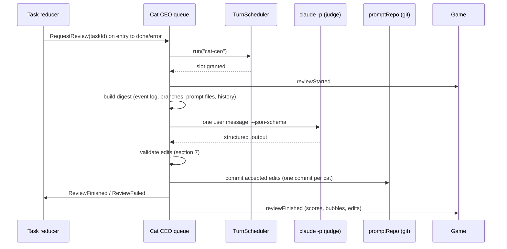

# Cat CEO: the judge that reviews cats and tunes their prompts

Date: 2026-10-06. Status: built in 1.4.1-cats.14 (decisions and the measured cost: ROADMAP, "Cat CEO"). Installed CLI: `2.1.290 (Claude Code)`.
Related: [task-state-machine.md](task-state-machine.md) §3.4 (review region), [context-policy.md](context-policy.md) §5 (prompt files).

## 1. Decisions

User decisions (2026-10-06):

- A separate **Cat CEO** sits above the boss. It is always on.
- It reviews the tasks that lower-rank cats did.
- On anomalies it edits their prompt md directly. Edits apply at once.
- Every version is committed to a local git repo in `~/.pixel-agents/prompts` (no remote). The game shows the diff and offers a one-click revert.
- The `Role & conduct` section is locked for the judge. It only adds, replaces or removes `Rules` and `Lessons` items.

Decisions made in this spec:

| #   | Decision                                                                                                                                                     | Reason                                                                                                                                                                                                                                                                  |
| :-- | :----------------------------------------------------------------------------------------------------------------------------------------------------------- | :---------------------------------------------------------------------------------------------------------------------------------------------------------------------------------------------------------------------------------------------------------------------- |
| D1  | One review per finished task (`done` or `error`), after the user has the result. No review per assignment report.                                            | The final outcome is known only at the end. One call per task bounds cost. Assignment reports are inputs of that review.                                                                                                                                                |
| D2  | No review for `cancelled`, `interrupted`, or tasks without a cat turn.                                                                                       | Nothing to judge, or the outcome is not the cats' doing.                                                                                                                                                                                                                |
| D3  | "Always on" = the Cat CEO character and its review queue are always present. Each review is a **fresh** `claude -p` process with `--no-session-persistence`. | The context policy keeps one session per unit of work ([context-policy.md](context-policy.md) §3). The RAM plan forbids resident processes (ROADMAP, Resource budget item 1). Memory between reviews is a bounded, server-built history block (§5.4), not chat history. |
| D4  | The judge gets no tools (`--tools ""`) and no MCP. The server puts every input into one message.                                                             | Deterministic input, no side effects, smaller prefix, nothing to escape.                                                                                                                                                                                                |
| D5  | Output is JSON validated by `--json-schema`. Prompt changes are structured item edits, never free rewrites.                                                  | The server can validate every edit before it touches a file.                                                                                                                                                                                                            |
| D6  | Model `opus` (resolves to `claude-opus-5-5` on this machine), effort `high`, `--max-budget-usd 1` per review. The user can change model and effort.          | Judging needs the strongest model. The budget flag is a hard stop.                                                                                                                                                                                                      |
| D7  | Rate limit: max 1 commit per cat per review, max 3 item changes per commit, max 2 Cat CEO commits per cat per rolling 24 h.                                  | An edit needs evidence from new tasks before the next one.                                                                                                                                                                                                              |
| D8  | Regression guard: auto-revert a Cat CEO commit when the cat's mean score drops by 15 points or more over its next 3 reviewed assignments. Flag at 8–14.      | Edits must earn their place. User commits are never auto-reverted.                                                                                                                                                                                                      |
| D9  | The review takes one slot of the global turn cap under cat id `cat-ceo`. Reviews run one at a time, FIFO, queue cap 10.                                      | Same RAM rule as the cats.                                                                                                                                                                                                                                              |

## 2. Place in the office

- The Cat CEO is not a node of the cat tree. `catTree.ts` rules (one boss, no cycles) do not change. It is stored as a block `catCeo` in `cats.json`: `{ enabled, name, appearance, model, effort, maxEditsPerCatPerDay }`. Default: enabled, name "Cat CEO", effort `high`, 2 edits per day.
- It may review every cat of the tree, the boss included. It never edits its own file `prompts/cat-ceo.md`; only the user edits that file.
- The Hierarchy tab shows it pinned above the boss, not draggable. The task form "Who" field does not list it.

## 3. Trigger and data flow



## 4. Command line

```text
claude -p --output-format json --json-schema '<schema of §6>' \
  --model opus --effort high --tools "" --strict-mcp-config --safe-mode \
  --no-session-persistence --max-budget-usd 1 \
  --append-system-prompt-file <stateDir>/cat-ceo/system.md
```

The user message (the digest) goes on stdin. Every flag above is in `claude --help` 2.1.290. `--json-schema` puts the result in the `structured_output` field of the JSON output ([headless § structured output](https://code.claude.com/docs/en/headless)). `--safe-mode` turns off CLAUDE.md, hooks, plugins and user MCP servers, so the user's setup cannot change a verdict (`claude --help`). `system.md` = the `Role & conduct` of `prompts/cat-ceo.md` + the fixed judge rules (§5.3). cwd = `<stateDir>/cat-ceo/` (an empty folder).

Probe (2026-10-06, Haiku 4.5, stdin prompt, `--tools "" --strict-mcp-config --safe-mode --no-session-persistence --json-schema …`): `structured_output` = `{"verdict":"concerns","score":35}`, `is_error: false`, `num_turns: 2`, $0.0117. So structured output works with all built-in tools off; it costs one extra internal turn.

## 5. Inputs

### 5.1 Digest (server-built, `server/src/catCeo/reviewDigest.ts`)

Hard cap: 60,000 chars (about 15K tokens). Each part has its own cap; cut text ends with `…[cut N chars]`.

| Part                | Content                                                                                                                                                                                                                                          | Cap                                  |
| :------------------ | :----------------------------------------------------------------------------------------------------------------------------------------------------------------------------------------------------------------------------------------------- | :----------------------------------- |
| Task                | id, title, user prompt, target, final state, final result or error, turns, cost, wall time                                                                                                                                                       | 4,000                                |
| Plan                | root `brief` text                                                                                                                                                                                                                                | 2,000                                |
| Assignments         | per assignment: id, parent → child, goal, end state (`done`, `rejected`, `failed`…), report text, turns, cost, `promptSha`                                                                                                                       | 2,000 each                           |
| Diffs               | per worker branch: `git diff --stat <base>...task/<id>-<cat>` + diff body; task diff (`task.diff`)                                                                                                                                               | 25,000 total, split by changed lines |
| Anomaly signals     | from the event log: nudges (A5), auto-reports (A6), failed turns and retries, timeouts, merge conflicts with the cat whose branch conflicted, office tool errors, unanswered asks (I7), rework (`rejected`), turn cap, `compact_boundary` events | 6,000                                |
| Tests run           | Bash tool calls whose command matches `test\|vitest\|jest\|pytest\|lint\|typecheck\|tsc\|build`, with `is_error` of the tool result                                                                                                              | 4,000                                |
| Transcript excerpts | per cat: last assistant text of each turn (200 chars each)                                                                                                                                                                                       | 6,000                                |
| Prompt files        | per reviewed cat: current `Rules` and `Lessons` items with ids; `Role & conduct` first 1,000 chars, marked read-only                                                                                                                             | 8,000                                |
| History             | §5.4                                                                                                                                                                                                                                             | 3,000                                |

### 5.2 What the digest never holds

MCP tokens, environment values, files outside the diffs, `~/.pixel-agents` paths. The secret scan of §7 runs on the digest too: a hit is replaced by `[redacted]`.

### 5.3 Fixed judge rules (in `system.md`)

- Score every assignment and the root's lead work with the rubric of §5.5. Cite evidence from the digest for every score below 70.
- Report an anomaly only with evidence. Propose an edit only for an anomaly with severity `medium` or `high`.
- `Rules` hold behaviour ("Run the tests before you report"). `Lessons` hold facts about the repo or tools ("The webview tests need `npm run build:core` first").
- Prefer `replace` of a weak item over `add`. Never edit `Role & conduct`. Never add praise, names of people, secrets, or paths outside the repo.

### 5.4 Bounded memory

The History part lists, for each reviewed cat: its last 5 scores (task id, score, verdict), its last 3 prompt commits (sha, author, summary, guard status). This is all the Cat CEO knows of the past. It replaces an always-on chat.

### 5.5 Rubric

| Criterion          | Weight | 100 % means                                                                            |
| :----------------- | :----- | :------------------------------------------------------------------------------------- |
| Goal fit           | 30     | The diff and the report do what the assignment asked, nothing missing                  |
| Verification       | 20     | Relevant tests/lint/build ran and the report states the result truthfully              |
| Protocol           | 20     | Used `report`, no nudge needed, answered asks, worked only in its folder, did not push |
| Scope and teamwork | 15     | No edits outside its part, caused no merge conflict; a lead split work without overlap |
| Efficiency         | 15     | Turns and cost fit the size of the change; no auto-compaction                          |

Score = weighted sum, 0–100. Task verdict: `pass` (every score ≥ 70, no `high` anomaly), `fail` (any score < 40, or a cat caused the task error), else `concerns`.

## 6. Output schema

```json
{
  "type": "object",
  "required": ["verdict", "summary", "scores", "anomalies", "edits"],
  "properties": {
    "verdict": { "enum": ["pass", "concerns", "fail"] },
    "summary": { "type": "string", "maxLength": 300 },
    "scores": {
      "type": "array",
      "items": {
        "type": "object",
        "required": ["catId", "assignmentId", "score", "criteria", "bubble"],
        "properties": {
          "catId": { "type": "string" },
          "assignmentId": { "type": "string", "description": "\"root\" for the lead's own work" },
          "score": { "type": "integer", "minimum": 0, "maximum": 100 },
          "criteria": {
            "type": "object",
            "properties": {
              "goalFit": { "type": "integer" },
              "verification": { "type": "integer" },
              "protocol": { "type": "integer" },
              "scope": { "type": "integer" },
              "efficiency": { "type": "integer" }
            }
          },
          "bubble": { "type": "string", "maxLength": 40 },
          "evidence": { "type": "array", "items": { "type": "string", "maxLength": 200 } }
        }
      }
    },
    "anomalies": {
      "type": "array",
      "items": {
        "type": "object",
        "required": ["id", "catId", "kind", "severity", "evidence"],
        "properties": {
          "id": { "type": "string" },
          "catId": { "type": "string" },
          "kind": {
            "enum": [
              "needed_nudge",
              "auto_report",
              "failed_turn",
              "timeout",
              "merge_conflict",
              "out_of_scope_edit",
              "no_tests_run",
              "false_claim",
              "rework",
              "ask_unanswered",
              "excessive_turns",
              "excessive_cost",
              "auto_compacted",
              "office_tool_misuse",
              "other"
            ]
          },
          "severity": { "enum": ["low", "medium", "high"] },
          "evidence": { "type": "string", "maxLength": 400 }
        }
      }
    },
    "edits": {
      "type": "array",
      "items": {
        "type": "object",
        "required": ["catId", "section", "op", "reason", "anomalyIds"],
        "properties": {
          "catId": { "type": "string" },
          "section": { "enum": ["Rules", "Lessons"] },
          "op": { "enum": ["add", "replace", "remove"] },
          "itemId": { "type": "string", "pattern": "^[RL][0-9]+$" },
          "text": { "type": "string", "maxLength": 280 },
          "reason": { "type": "string", "maxLength": 200 },
          "anomalyIds": { "type": "array", "items": { "type": "string" }, "minItems": 1 }
        }
      }
    }
  }
}
```

`replace` and `remove` need `itemId`; `add` and `replace` need `text`. The server checks these, because the CLI treats the schema as a shape check only.

## 7. Edit validation and apply (`server/src/catCeo/promptPatch.ts`)

Each edit passes every check, or it is rejected with a reason. Rejected edits stay in the review record.

1. Target cat is in the task team and is not `cat-ceo`.
2. `section` is `Rules` or `Lessons`. After the edits, `Role & conduct` is byte-identical to the committed version (locked-section check).
3. `itemId` exists in that section for `replace` / `remove`. `itemId` prefix matches the section.
4. `text`: one line, ≤ 280 chars, no `#` at line start, no `<!--`, no backticks block fence.
5. Caps of [context-policy.md](context-policy.md) §5.3 hold after the edit (12 Rules, 20 Lessons, 32 KB). `add` over a cap is rejected.
6. Secret scan: `sk-ant-`, `sk-[A-Za-z0-9]{20,}`, `ghp_`, `github_pat_`, `xox[abp]-`, `AKIA[0-9A-Z]{16}`, `-----BEGIN`, hex or base64 runs of 32+ chars, any MCP token of the task, `/Users/`, `~/.pixel-agents`.
7. Dedupe: normalize (lower case, collapse spaces, drop punctuation). Reject when equal to, or token Jaccard ≥ 0.8 with, any item of the same cat's Rules or Lessons.
8. Rate limit (D7). The edits beyond the limit are rejected, in schema order.
9. The parsed file renders back with `renderPromptFile`; the new id is max id + 1 in that section; the suffix `(task <id>, <date>)` is added by the server.

Apply: write the file, then one commit per cat in the prompts repo.

### 7.1 Commit message format

```text
cat-ceo(<catId>): <first edit summary, ≤ 60 chars>

Task: <taskId> "<task title>"
Review: <reviewId>  Score: <score>/100  Verdict: <verdict>
Changes:
- add Rules R4: <text, cut to 72 chars>
- replace Lessons L2: <text, cut to 72 chars>
Anomalies: <kind>, <kind>

Prompt-Edit-By: cat-ceo
Prompt-Review: <reviewId>
```

Other authors use the same subject form: `user(<catId>): edit Role & conduct`, `user(<catId>): revert <short sha>`, `user(<catId>): manual edit`, `guard(<catId>): revert <short sha> (score drop <n>)`. The trailer `Prompt-Edit-By:` is `cat-ceo`, `user` or `guard`. The UI reads authors from the trailer. Commits use `git -c user.name=catavasia -c user.email=catavasia@localhost` so no global identity is needed.

## 8. Regression guard (`server/src/catCeo/regressionGuard.ts`)

- Each score has the `promptSha` the cat used ([context-policy.md](context-policy.md) §6).
- For a Cat CEO commit C of cat X: before = X's last 5 scores with a sha older than C (need ≥ 3). After = X's first 3 scores with a sha that contains C.
- When `mean(after) ≤ mean(before) − 15`: `git revert --no-edit C` as `guard(X)`, mark C `reverted` in the UI, and block Cat CEO edits of X for 24 h.
- When the drop is 8–14: flag C with a "watch" badge, no revert.
- When the revert conflicts (a later commit changed the same items): no revert; flag "manual review" and leave the file as it is.
- The guard runs after every `ReviewFinished` for every cat the review scored.

## 9. Game representation

- **Character.** Spawns at server start when enabled and stays (no task binding). It uses its own `appearance` from the Cats menu; default breed preset + gold collar (`#d4af37`). No new sprite art.
- **Seat.** An Area whose label contains "head" wins, like the meeting-room rule (ROADMAP, Office scenes). Else the first free desk seat in layout order. The seat is held as a `seat` reservation.
- **Idle.** It joins idle activities like any cat. While a review runs it sits at its seat with the narrator line "inspecting the catch" (new work phase `reviewing`).
- **Review scene.** On `reviewFinished`, it walks to each scored cat in score order, lowest first, as an office-scenes talk of new kind `review` (max 4 walks; other cats get a bubble from its seat). Bubble = `<score> · <bubble>`, for example "58 · forgot the tests". The reviewed cat reacts with the social pictograms: heart at ≥ 70, sweat drop at 40–69, anger mark below 40. When an edit was committed for that cat, a second bubble shows "new rule R4" or "new lesson L7". Then it walks back to its seat. The talk queue rules of office scenes apply (one talk per cat at a time).
- **Task card.** A review badge (score range and verdict). Hover shows `summary`.

## 10. Prompt history UI and wire

Cats menu → Agents → select a cat → **Prompt history** button:

- List of commits, newest first: date, author (Cat CEO / You / Guard), subject, task link, the cat's mean score before and after, badges `reverted` / `watch` / `manual review`.
- Click an entry: unified diff of that commit (`git show <sha> -- <cat>.md`), coloured by line.
- **Revert this change** (inline confirm; VS Code webviews block `window.confirm`): `git revert`. **Restore this version**: writes that version and commits `user(<cat>): restore <short sha>`.
- The Agents tab shows the current Rules and Lessons as read-only lines with a delete button each (commit `user(<cat>): remove R3`).

New wire messages in `core/asyncapi.yaml` (all client → server changes need the server token, like profile edits):

| Direction       | Message                                                                                                                                                           |
| :-------------- | :---------------------------------------------------------------------------------------------------------------------------------------------------------------- |
| server → client | `reviewStarted {taskId, reviewId}`                                                                                                                                |
| server → client | `reviewFinished {taskId, reviewId, verdict, summary, scores[{catId, assignmentId, score, bubble}], edits[{catId, sha, subject}], rejectedEdits[{catId, reason}]}` |
| server → client | `promptHistory {catId, entries[{sha, at, author, subject, taskId?, flag?}]}`, `promptDiff {catId, sha, diff}`                                                     |
| server → client | `catCeoSettings {enabled, model, effort, maxEditsPerCatPerDay}`                                                                                                   |
| client → server | `getPromptHistory {catId}`, `getPromptDiff {catId, sha}`                                                                                                          |
| client → server | `revertPromptEdit {catId, sha}`, `restorePromptVersion {catId, sha}`, `removePromptItem {catId, itemId}`, `setCatCeoSettings {…}`                                 |

## 11. Cost per review

Prices: Opus 5.5 $4 input, $8 1h cache write, $0.20 cache read, $20 output per MTok ([pricing](https://platform.claude.com/docs/en/about-claude/pricing)). The CLI writes the cache with the 1h TTL (ROADMAP phase 1, measured).

| Part                                                                                          | Tokens                                              | Cost                                                          |
| :-------------------------------------------------------------------------------------------- | :-------------------------------------------------- | :------------------------------------------------------------ |
| CLI default prompt without tools (probe: first request wrote 10,216 with `--tools ""`, Haiku) | ~10K, ~6K of it shared across sessions (cache read) | ~$0.03 write + ~$0.001 read                                   |
| Judge rules + Role                                                                            | ~1.5K                                               | ~$0.01                                                        |
| Digest (cap 60,000 chars)                                                                     | ≤ 15K, typical 8K                                   | $0.06–0.12 (1h write)                                         |
| Output incl. thinking                                                                         | 2K–5K                                               | $0.04–0.10                                                    |
| **Total**                                                                                     |                                                     | **≈ $0.15–0.25 per review**, hard cap $1 (`--max-budget-usd`) |

At 20 tasks a day: about $3–5 a day. Sonnet 5.5 as judge halves it. Step 8 of the plan measures the real number.

## 12. Implementation plan

1. `core/src/catCeo.ts` + `core/asyncapi.yaml`: types and messages of §10; `StoredTask.review`. Test: asyncapi contract test.
2. `server/src/catCeo/reviewDigest.ts`: digest from the event log ([task-state-machine.md](task-state-machine.md) §9), branches and prompt files, with caps and redaction. Test: `__tests__/catCeoDigest.test.ts` on a recorded log; caps hold; a planted token is redacted.
3. `server/src/catCeo/judgeSchema.ts` + `judgeRunner.ts`: spawn per §4, parse `structured_output`, map errors to `ReviewFailed`. Test: fake `claude` bin script that prints a fixed JSON result; one that exits 1.
4. `server/src/catCeo/promptPatch.ts`: §7 checks on top of `promptFile.ts` ([context-policy.md](context-policy.md) step 1). Test: one case per check, including the locked Role byte check and the rate limit.
5. `server/src/catCeo/catCeo.ts`: queue (D9), apply via `promptRepo.ts`, commit format §7.1. `regressionGuard.ts` per §8. Test: scripted scores → revert at −15, flag at −10, no revert on conflict.
6. `server/src/orchestrator/catProfiles.ts`: `catCeo` block in `cats.json`, settings messages. Test: load old file → default block; save round trip.
7. Webview: Cat CEO character and seat (`engine/officeScenes.ts`, new talk kind `review`), task card badge, `webview-ui/src/cats/PromptHistory.tsx`. Test: webview unit tests with `__pixelAgentsTestHooks.emitOrchestratorEvent`; screenshot of a review walk.
8. Real e2e: one 2-worker task with a planted protocol slip (worker never runs tests). Expect a `no_tests_run` anomaly, one Rules edit, one commit in `~/.pixel-agents/prompts`. Record the measured cost in ROADMAP in a later docs PR.

## 13. Open questions

None blocking. The weights of §5.5 and the thresholds of D7/D8 are first guesses; the Cat CEO review records keep all scores, so they can be tuned from data later.

## 14. Prompt hygiene: the tidy

User requirement (2026-10-06): "The CEO also re-checks the cats' rules and lessons, optimizes them, removes what is unnecessary." Built in 1.4.1-cats.15. Code: `server/src/catCeo/tidy.ts`, `tidySchema.ts`, `tidyDigest.ts`, `tidyPatch.ts`.

### 14.1 Decisions

| #   | Decision                                                                                                                                                                                                                      | Reason                                                                                     |
| :-- | :---------------------------------------------------------------------------------------------------------------------------------------------------------------------------------------------------------------------------- | :----------------------------------------------------------------------------------------- |
| T1  | A tidy is one fresh `claude -p` per cat, with the review flags (§4), its own schema and rules, the same model and effort, and `--max-budget-usd 1`. It runs in the `cat-ceo` scheduler slot and shares the review queue (D9). | Same safety model and RAM rule as a review. Reviews and tidies never run at the same time. |
| T2  | Ops: `merge` (2+ cited ids become one new id at the place of the first source), `rewrite` (same id, same meaning), `remove`, `keep`. Each has a one-line reason. No `add`.                                                    | A tidy only shrinks the list. A rewrite keeps its meaning, so it keeps its id.             |
| T3  | Triggers: Rules ≥ 10 of 12 or Lessons ≥ 16 of 20 (80 %), 10 reviews of the cat since its last tidy, "Tidy now" in Prompt history (token-gated `tidyPrompt`), and a weekly sweep over all cats (checked every hour).           | The user's list. The first start only sets the sweep clock: an upgrade does not tidy all.  |
| T4  | Skip when the file's head commit equals the head after the last tidy. Automatic tidies: at most 1 per cat per rolling 24 h (a failed run counts), none while the guard blocks the cat. Manual: no daily limit.                | No repeat cost for an unchanged file, and no retry loop after every review.                |
| T5  | A tidy commit (`cat-ceo(<cat>): tidy — merged N, rewrote M, removed K`, trailers `Prompt-Edit-By: cat-ceo` and `Prompt-Tidy: <id>`) does not count against the 2 review edits per day.                                        | Its own limit is T4.                                                                       |
| T6  | Item owner = `user` when a user commit added the item or changed its text, or when the item has no history in the newest 200 commits. Else `cat-ceo`.                                                                         | Read from the prompts repo, so hand edits and restores count. Unknown = protected.         |
| T7  | User items: a `remove` is never applied, only marked. `merge` and `rewrite` are applied only with the setting "CEO may tidy my items" (`tidyUserItems`, default off), else marked. Marked changes show in the UI only.        | A tidy may not remove a user item without marking it.                                      |
| T8  | At most 8 applied changes per tidy. The new text of a merge or rewrite is never longer than its sources, so the net size never grows.                                                                                         | A bounded diff. Shorter is the point.                                                      |
| T9  | The server strips any `(task …)` or `(tidy …)` suffix from the model's text. A rewrite keeps the source suffix. A merge gets `(tidy <id>, <date>)`.                                                                           | Provenance stays, and dedupe ignores both suffixes.                                        |
| T10 | The judge CLI runs with `--settings '{"language":"en"}'` (reviews too). The user's `language: ru` setting made the first real tidy answer in Russian despite the rules.                                                       | English output in commits and in the UI.                                                   |

### 14.2 Input (digest)

Role & conduct (first 1,000 chars, read-only context), the cat's last 10 scores, its last 5 review summaries with its anomalies, and each item with: owner, when, by whom and in which task it was added, the anomaly kinds of that review, the last edit, the reviews since, how often later anomaly evidence cites its id, how often the same anomaly kind came back, and the mean score before and after. The digest is redacted like the review digest.

### 14.3 Validation

Per op: the ids exist in the op's section and appear in no other op. A merge cites 2+ ids, a rewrite exactly 1. The text passes check 4 of §7, the secret scan, the 280-char cap, the size rule (T8), and dedupe against the items that stay. A rewrite must change the text. Then the file caps hold and `Role & conduct` is byte-identical (a break throws: it is a bug, not a model error). The file must not change while the judge runs; else the tidy fails and applies nothing.

### 14.4 Guard, UI, game

- The regression guard treats a tidy commit like any Cat CEO commit (§8): a 15-point drop reverts it as `guard(<cat>)`.
- Prompt history: "Tidy now" with the tidy state, the last tidy (summary, cost, marked rows), and for a tidy commit a per-item table (change, before, after, reason) above the diff. Cat CEO editor: the "CEO may tidy my items" line.
- Game: on `promptTidy` done with changes, the Cat CEO walks to the cat as a `review` talk "tidied N items". No new sprite.
