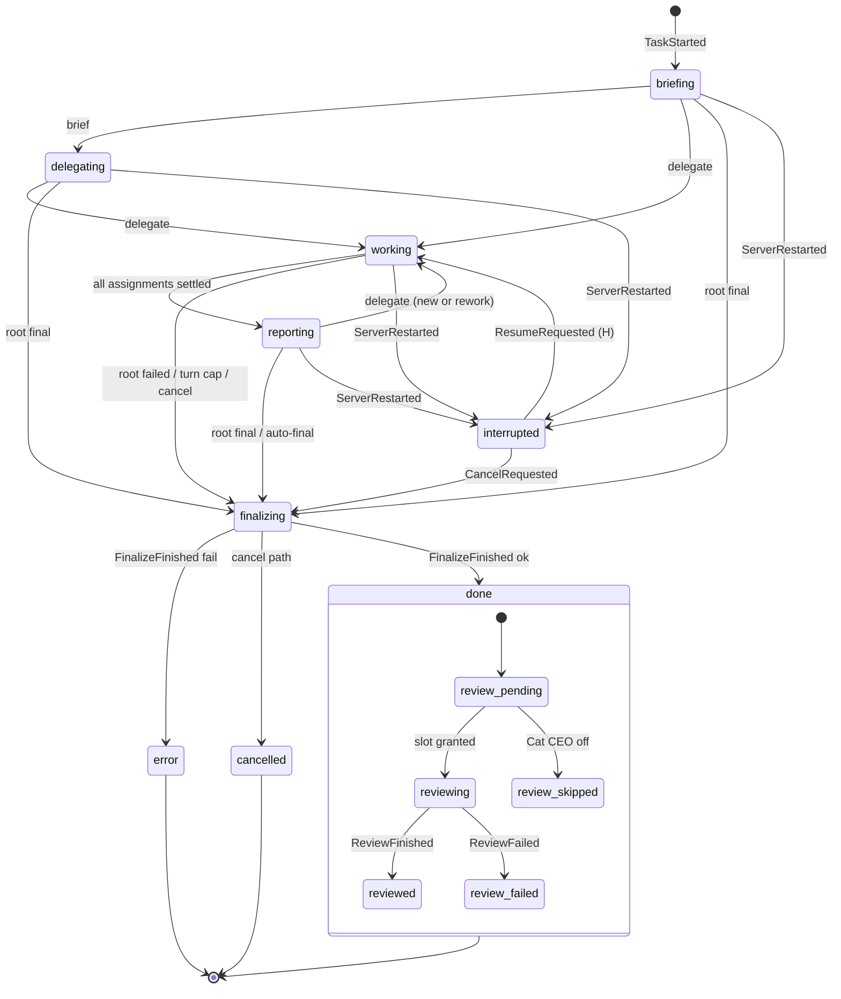
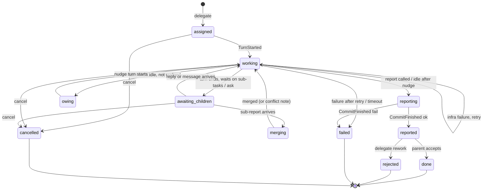

# Team task as a state machine (orchestrator v2 spec)

Date: 2026-10-06. Status: built in 1.4.1-cats.13 (review region: built in 1.4.1-cats.14, see cat-ceo-judge.md). Base: phase 1 code on `main` (`server/src/orchestrator/`).
User request: "make the task execution structure with delegation/orchestration by the canons of a state machine".
Related specs: [context-policy.md](context-policy.md) (sessions and prompts), [cat-ceo-judge.md](cat-ceo-judge.md) (post-done review).

## 1. Decisions in short

- One pure reducer per task: `reduce(state, event) → { state, effects[], reply? }`. An interpreter runs the effects and feeds their results back as events.
- Three machines: the **task** machine, one **assignment** machine per delegation, and one **turn** region per cat in the task. Hierarchy and parallel regions are plain nested data, not a library.
- Hand-written typed reducer. No XState (section 7).
- Persistence = append-only event log + snapshot per task. A restart replays the log and resumes deterministically. The task stops in `interrupted` until the user presses Resume.
- New behaviour on top of phase 1: turn timeout, one retry for infrastructure failures, user cancel, resume after restart, explicit rework (`delegate` with `rework: true`), Cat CEO review region after `done`.

## 2. Vocabulary

| Term       | Meaning                                                                                                                                          |
| :--------- | :----------------------------------------------------------------------------------------------------------------------------------------------- |
| Task       | One team task from the task board. Phase 1 type: `Flow` + `StoredTask.flow`.                                                                     |
| Member     | One cat taking part in one task. It owns one session, one inbox and one turn region. Phase 1 type: `Member`.                                     |
| Assignment | One `delegate` call: parent cat, child cat, goal. Phase 1 type: `TaskFlowNode` (one node per cat, reused). v2 gives every delegation its own id. |
| Turn       | One engine process run for one member: one user message in, one `result` out.                                                                    |
| Settled    | An assignment state in {`reported`, `done`, `rejected`, `failed`, `cancelled`}.                                                                  |
| Open       | Any assignment state that is not settled.                                                                                                        |

## 3. Task machine

### 3.1 States

| State         | Wire `FlowState`  | Meaning                                                                                        |
| :------------ | :---------------- | :--------------------------------------------------------------------------------------------- |
| `briefing`    | `briefing`        | Initial. The root reads the task. It ends at the first `brief` or `delegate`.                  |
| `delegating`  | `delegating`      | The root called `brief` and no assignment exists yet.                                          |
| `working`     | `working`         | At least one assignment is open.                                                               |
| `reporting`   | `reporting`       | Every assignment under the root is settled. The root builds the final result.                  |
| `finalizing`  | `merging`         | Turns are stopped. Worker worktrees are committed and removed. The task worktree is finalized. |
| `done`        | `done`            | Terminal for the user. The result is on `task/<id>`. The review region starts (section 3.4).   |
| `error`       | `error`           | Terminal. Root failure, turn cap, or finalize failure. The review region starts too.           |
| `cancelled`   | `cancelled` (new) | Terminal. The user cancelled. No review.                                                       |
| `interrupted` | `interrupted`     | Not terminal. The server stopped. `Resume` returns to the saved state (history `H`).           |

A root that has no reports goes `briefing → finalizing` directly when it reports.

### 3.2 Task events, guards and actions

| #   | From                     | Event                                            | Guard                                     | To                   | Actions (effects)                                                                                                            |
| :-- | :----------------------- | :----------------------------------------------- | :---------------------------------------- | :------------------- | :--------------------------------------------------------------------------------------------------------------------------- |
| T1  | (none)                   | `TaskStarted{taskId, rootId, prompt, cats}`      | root is in `cats`                         | `briefing`           | `JoinMember(root)`, deliver root task message, `Emit(flowStateChanged)`, `Emit(catMessage task)`                             |
| T2  | `briefing`               | `ToolCalled(brief)`                              | caller = root                             | `delegating`         | store `brief`, `Emit(catMessage brief)`                                                                                      |
| T3  | `briefing`, `delegating` | `ToolCalled(delegate)` accepted                  | assignment guards (A1)                    | `working`            | create assignment (A1)                                                                                                       |
| T4  | `working`                | assignment settles                               | no open assignment under root             | `reporting`          | `Emit(flowStateChanged)`                                                                                                     |
| T5  | `reporting`              | `ToolCalled(delegate)` accepted                  | A1 guards                                 | `working`            | create assignment                                                                                                            |
| T6  | any active               | root turn ends with `final`                      | no open assignment, no unread report (I3) | `finalizing`         | `KillTurn` for every running turn, `FinalizeWorkspaces(ok)`                                                                  |
| T7  | any active               | root auto-final (second idle turn, R4)           | same as T6                                | `finalizing`         | same as T6                                                                                                                   |
| T8  | `finalizing`             | `FinalizeFinished{ok, error?}`                   | ok and no error                           | `done`               | `ReleaseCharacters`, `SaveTask`, `Emit(flowStateChanged done)`, start review region                                          |
| T9  | `finalizing`             | `FinalizeFinished`                               | not ok                                    | `error`              | same as T8 with `error`                                                                                                      |
| T10 | any active               | root `TurnFinished{ok:false}` after retries      | (none)                                    | `finalizing(fail)`   | `FinalizeWorkspaces(fail)` → `error`                                                                                         |
| T11 | any active               | `TurnGranted` would exceed `FLOW_MAX_TURNS` (80) | turns ≥ cap                               | `finalizing(fail)`   | error text "Stopped: the team used more than 80 turns."                                                                      |
| T12 | any active               | `CancelRequested{by:user}`                       | user token                                | `finalizing(cancel)` | `KillTurn` all, every open assignment → `cancelled`, then `cancelled`                                                        |
| T13 | any active               | `ServerRestarted` (synthetic, on load)           | (none)                                    | `interrupted`        | save `H` = previous state; every running turn → `TurnInterrupted`                                                            |
| T14 | `interrupted`            | `ResumeRequested{by:user}`                       | user token                                | `H`                  | re-join members (new MCP tokens), requeue in-flight messages with the restart note, `RequestTurn` for each member with inbox |
| T15 | `interrupted`            | `CancelRequested`                                | user token                                | `finalizing(cancel)` | as T12                                                                                                                       |

"Any active" = `briefing`, `delegating`, `working`, `reporting`.

### 3.3 Statechart



`interrupted --> working` stands for "back to `H`", the saved state.

### 3.4 Review region (post-done)

`done` and `error` have one inner region for the Cat CEO review ([cat-ceo-judge.md](cat-ceo-judge.md)). The user gets the result at `done`. The review never blocks or changes the result.

| From             | Event                                    | Guard                             | To               | Actions                                                         |
| :--------------- | :--------------------------------------- | :-------------------------------- | :--------------- | :-------------------------------------------------------------- |
| (entry)          | enter `done` / `error`                   | Cat CEO on, task had ≥ 1 cat turn | `review_pending` | `RequestReview(taskId)`                                         |
| (entry)          | enter `done` / `error`                   | Cat CEO off                       | `review_skipped` | none                                                            |
| `review_pending` | `ReviewStarted`                          | (none)                            | `reviewing`      | `Emit(reviewStarted)`                                           |
| `reviewing`      | `ReviewFinished{verdict, scores, edits}` | (none)                            | `reviewed`       | store scores per assignment, `Emit(reviewFinished)`, `SaveTask` |
| `reviewing`      | `ReviewFailed{error}`                    | (none)                            | `review_failed`  | log, `SaveTask`                                                 |

## 4. Assignment machine (one per `delegate`)

### 4.1 States

| State               | Meaning                                                                                                    |
| :------------------ | :--------------------------------------------------------------------------------------------------------- |
| `assigned`          | The task message is in the child's inbox. No turn has started for it.                                      |
| `working`           | The child has a turn queued or running for this assignment.                                                |
| `awaiting_children` | The child's turn ended. It has open sub-assignments or an unanswered `ask`. No turn is queued.             |
| `merging`           | A sub-report arrived. The server merges the sub-branch into the child's worktree before its next turn.     |
| `owing`             | The child's turn ended with nothing to wait for and no report. One nudge is queued.                        |
| `reporting`         | The child called `report` (or the auto-report rule fired). The worktree commit runs.                       |
| `reported`          | The report and the branch reached the parent's inbox. Settled.                                             |
| `done`              | The parent accepted the work: the parent reported, or delegated new work without `rework`. Terminal.       |
| `rejected`          | The parent called `delegate(rework: true)` to the same cat. A new assignment carries `reworkOf`. Terminal. |
| `failed`            | Failure report: the turn failed after retries, timed out, or the commit failed. Terminal.                  |
| `cancelled`         | The task was cancelled while the assignment was open. Terminal.                                            |

`merging` has one inner flag, `conflict`. While it is set, the server merges no other branch into that worktree. The next turn starts with the conflict note. The flag clears when `git` shows no unmerged path before a turn.

### 4.2 Transition table

| #   | From                | Event                                        | Guard                                                                           | To                     | Actions                                                                                                                                                                                       |
| :-- | :------------------ | :------------------------------------------- | :------------------------------------------------------------------------------ | :--------------------- | :-------------------------------------------------------------------------------------------------------------------------------------------------------------------------------------------- |
| A1  | (none)              | `ToolCalled(delegate{to, task, rework?})`    | caller is parent of `to` (tree), `to` in task team, `to` has no open assignment | `assigned`             | new id; when `rework`: previous `reported` assignment of `to` → `rejected`, else → `done`; `JoinMember(to)` if new; deliver delegate message; `Emit(catMessage delegate)`; reply "Delegated…" |
| A2  | `assigned`          | `TurnStarted` of child                       | (none)                                                                          | `working`              | none                                                                                                                                                                                          |
| A3  | `working`           | `TurnFinished{ok}`                           | report called and no unread sub-report                                          | `reporting`            | `CommitWorktree(child)`                                                                                                                                                                       |
| A4  | `working`           | `TurnFinished{ok}`                           | open sub-assignment or child waits on `ask`                                     | `awaiting_children`    | none                                                                                                                                                                                          |
| A5  | `working`           | `TurnFinished{ok}`                           | nothing to wait for, no report, not nudged                                      | `owing`                | deliver `NUDGE_REPORT`, `nudged = true`, `Emit(catMessage nudge)`                                                                                                                             |
| A6  | `working`           | `TurnFinished{ok}`                           | nothing to wait for, no report, already nudged                                  | `reporting`            | last text = report, `CommitWorktree(child)`                                                                                                                                                   |
| A7  | `owing`             | `TurnStarted`                                | (none)                                                                          | `working`              | none                                                                                                                                                                                          |
| A8  | `awaiting_children` | sub-assignment → `reported`                  | branch exists                                                                   | `merging`              | `MergeBranches(child)` before its next turn                                                                                                                                                   |
| A9  | `awaiting_children` | message in inbox (reply, ask, user)          | (none)                                                                          | `working`              | `RequestTurn(child)`                                                                                                                                                                          |
| A10 | `merging`           | `MergeFinished{ok}` for every pending branch | (none)                                                                          | `working`              | merge notes go first in the next message                                                                                                                                                      |
| A11 | `merging`           | `MergeFinished{conflicts}`                   | (none)                                                                          | `working` + `conflict` | conflict note; later branches wait                                                                                                                                                            |
| A12 | `reporting`         | `CommitFinished{ok}`                         | (none)                                                                          | `reported`             | parent `pendingMerges += child` (if branch), `unreadReports++`, deliver report; parent assignment: A8                                                                                         |
| A13 | `reporting`         | `CommitFinished{ok:false}`                   | (none)                                                                          | `failed`               | deliver failure report with the commit error                                                                                                                                                  |
| A14 | `working`           | `TurnFinished{ok:false}`                     | retries left (R2)                                                               | `working`              | requeue in-flight message, `StartTimer(retry, 10 s)`                                                                                                                                          |
| A15 | `working`           | `TurnFinished{ok:false}`                     | no retries left, or timeout                                                     | `failed`               | drop `outgoingReport`; deliver failure report to parent                                                                                                                                       |
| A16 | `reported`          | parent turn reads it, then parent reports    | (none)                                                                          | `done`                 | none                                                                                                                                                                                          |
| A17 | any open            | `CancelRequested`                            | (none)                                                                          | `cancelled`            | none                                                                                                                                                                                          |
| A18 | any open            | `ServerRestarted`                            | (none)                                                                          | same state             | the task holds `interrupted`; the assignment state is kept                                                                                                                                    |

The root has no assignment. Its "report" is the `final` result (T6). Rules A3–A6 apply to the root with "report" read as "final".

### 4.3 Statechart



## 5. Turn region (one per member)

| #   | From                   | Event                                     | Guard                    | To          | Actions                                                                                                            |
| :-- | :--------------------- | :---------------------------------------- | :----------------------- | :---------- | :----------------------------------------------------------------------------------------------------------------- |
| R1  | `idle`                 | inbox or pending merge becomes non-empty  | task active              | `queued`    | `RequestTurn(catId)`                                                                                               |
| R2  | `queued`               | `TurnGranted{turnId}`                     | turns < `FLOW_MAX_TURNS` | `preparing` | `turns++`; `PrepareWorkspace` if no cwd; `MergeBranches` if pending                                                |
| R3  | `queued`               | `TurnLockBusy` (the user holds the wheel) | (none)                   | `lock_wait` | `StartTimer(lock, SESSION_LOCK_RETRY_MS = 5 s)`                                                                    |
| R4  | `lock_wait`            | `TimerFired(lock)`                        | (none)                   | `queued`    | `RequestTurn`                                                                                                      |
| R5  | `preparing`            | workspace and merges done                 | inbox not empty          | `running`   | take inbox into `inFlight`; `SpawnTurn{turnId, message, resume: started}`; `StartTimer(turn, TURN_TIMEOUT_MS)`     |
| R6  | `running`              | `TurnStarted{agentId}`                    | (none)                   | `running`   | `Emit(catTurnStarted)`, `setHeadlessAgentActive(true)`                                                             |
| R7  | `running`              | `TurnFinished{…}`                         | (none)                   | `idle`      | `CancelTimer(turn)`, cost delta, `Emit(catTurnFinished)`, answer asks, assignment rules A3–A6/A14/A15, R1 if inbox |
| R8  | `running`              | `TimerFired(turn)`                        | (none)                   | `running`   | `KillTurn` → a `TurnFinished{ok:false, error:"timeout"}` follows                                                   |
| R9  | `running`, `preparing` | `ServerRestarted`                         | (none)                   | `idle`      | keep `inFlight` for T14                                                                                            |

Retry rule (A14): a failure with no `result` event (spawn error, crash, non-zero exit) or a `result` with `is_error` gets one retry after 10 s. A timeout gets no retry. Constants: `TURN_RETRY_MAX = 1`, `TURN_RETRY_DELAY_MS = 10_000`, `TURN_TIMEOUT_MS = 1_800_000` (30 min).

The global cap (Settings → Cats Working at Once) stays in `TurnScheduler`, outside the reducer. It is a shared resource for all tasks and the Cat CEO. `TurnGranted` is the scheduler's answer to `RequestTurn`.

## 6. Invariants

The reducer checks these after every event in tests (`assertInvariants(state)`). A violation in production logs an error and moves the task to `error`.

| #   | Invariant                                                                                                                                                                                                                                 |
| :-- | :---------------------------------------------------------------------------------------------------------------------------------------------------------------------------------------------------------------------------------------- |
| I1  | One active turn per cat: at most one member per cat id is in `queued`, `lock_wait`, `preparing` or `running` across all tasks (scheduler) and inside one task (reducer).                                                                  |
| I2  | A cat has at most one open assignment per task.                                                                                                                                                                                           |
| I3  | A cat cannot report (or the root give the final result) while an assignment below it is open, or while a report or its branch is unread.                                                                                                  |
| I4  | A report reaches the parent only after the child's worktree commit succeeded. The parent reads the report only after its branch merged (or the merge note says why not).                                                                  |
| I5  | No merge into a worktree that has unmerged paths.                                                                                                                                                                                         |
| I6  | The briefing always closes: every path out of `briefing` emits a `flowStateChanged` with a state other than `briefing`, also on cancel, error and restart. The office scenes end the meeting only on that event (ROADMAP, office scenes). |
| I7  | Every `ask` gets an answer: a `reply`, the target's last text, or the failure text.                                                                                                                                                       |
| I8  | `turns ≤ FLOW_MAX_TURNS`.                                                                                                                                                                                                                 |
| I9  | No process starts after the task left the active states.                                                                                                                                                                                  |
| I10 | Every `catTurnStarted` has exactly one `catTurnFinished` with the same cat and task.                                                                                                                                                      |
| I11 | The reducer is pure: no clock, no random, no I/O. Time and ids come in events.                                                                                                                                                            |

## 7. Typed reducer, not XState

Checked 2026-10-06: no state-machine library in `package.json`, `server/package.json` or `webview-ui/package.json` (`grep xstate` finds nothing). YAGNI ladder:

1. Needed: yes. Phase 1 spreads the state over flags (`scheduled`, `nudged`, `retryAt`, `busy`, `final`, `outgoingReport`) in `flowTurns.ts` and `orchestrator.ts`. Restart and cancel cannot be added safely on top of it.
2. Already in the codebase: the office scenes and the character FSM are hand-written state machines. The same style fits here.
3. Stdlib/TypeScript: discriminated unions for states and events, and an exhaustive `switch` with `never` checks, give compile-time coverage of the transition table.
4. XState v5 would add a dependency and an actor runtime. We still need our own interpreter for git, processes and the turn scheduler. Persisted XState snapshots also tie the log to the machine definition version.

Decision: hand-written reducer, about 600 lines over 3–4 files, each under 400 lines.

## 8. Interpreter and effects

```ts
type Step = { state: TaskState; effects: Effect[]; reply?: ToolReply };
function reduce(state: TaskState, event: TaskEvent): Step;
```

| Effect                           | Runs                                                                                                | Result event(s)                                    |
| :------------------------------- | :-------------------------------------------------------------------------------------------------- | :------------------------------------------------- |
| `JoinMember{catId}`              | new session UUID, MCP token, persona + MCP config files ([context-policy.md](context-policy.md) §6) | `MemberJoined{catId, sessionId}`                   |
| `PrepareWorkspace{catId}`        | `createWorktree` on `task/<id>-<cat>`                                                               | `WorkspaceReady` / `WorkspaceFailed`               |
| `RequestTurn{catId}`             | `TurnScheduler.run` + `acquireSessionLock(sessionId, 'turn')`                                       | `TurnGranted{turnId}` / `TurnLockBusy`             |
| `MergeBranches{catId}`           | `unmergedPaths`, `commitAll`, `mergeBranch --no-ff`                                                 | `MergeFinished{child, ok, conflicts}`              |
| `SpawnTurn{…}`                   | `ensureCharacter`, `adapter.spawnTurn`                                                              | `TurnStarted{agentId}`, `TurnFinished{…}`          |
| `KillTurn{turnId}`               | `handle.kill()`                                                                                     | the `TurnFinished` of that turn                    |
| `CommitWorktree{catId, message}` | `commitAll`                                                                                         | `CommitFinished`                                   |
| `StartTimer` / `CancelTimer`     | `setTimeout`                                                                                        | `TimerFired{id}`                                   |
| `Emit{message}`                  | `opts.emit` (WebSocket)                                                                             | none                                               |
| `Narrate{input}`                 | `opts.narrate`                                                                                      | none                                               |
| `SaveTask`                       | task board sink                                                                                     | none                                               |
| `FinalizeWorkspaces{mode}`       | `endFlowWorkspaces`, remove token files                                                             | `FinalizeFinished`                                 |
| `ReleaseCharacters`              | `finishHeadlessAgent` per member                                                                    | none                                               |
| `RequestReview{taskId}`          | Cat CEO queue                                                                                       | `ReviewStarted`, `ReviewFinished` / `ReviewFailed` |

Log-only events change no state but go into the log for the Cat CEO digest: `ToolActivity{catId, tool, isError}` (from stream-json) and `CompactHappened{catId, trigger, preTokens, postTokens}` ([context-policy.md](context-policy.md) §4).

The interpreter runs effects in order. Each task has one event queue, so events of one task never interleave. Office tool calls arrive over MCP as `ToolCalled{callId, catId, name, args}`. The interpreter appends the event, reduces it, runs the effects, and returns `reply` as the MCP tool result.

## 9. Persistence and restart

- Directory: `~/.pixel-agents/flows/<taskId>/`. It is separate from `orchestrator/<taskId>/`, which holds token files and is removed at task end.
- `events.jsonl`: one line per event: `{seq, at, event}`. The interpreter appends and `fsync`s before it runs the effects of that event. No secrets: MCP tokens never enter the log.
- `snapshot.json`: `{seq, state}`, written atomically (tmp + rename) after every `TurnFinished` and every terminal state.
- Load: read the snapshot, replay the events with `seq` above it, then reduce `ServerRestarted` for each task in an active state (T13).
- Determinism: the reducer reads time only from `event.at` and ids only from events. A replay of the same log gives the same state. A test replays every recorded log and compares with the snapshot.
- Retention: logs of finished tasks stay. The Cat CEO reads them ([cat-ceo-judge.md](cat-ceo-judge.md) §5.1). Logs older than 30 days are deleted at server start.

## 10. Phase 1 behaviour and game events on the machine

| Phase 1 behaviour (file)                                                                  | v2 rule                    |
| :---------------------------------------------------------------------------------------- | :------------------------- |
| `start()` sets `briefing`, delivers root message (`orchestrator.ts`)                      | T1                         |
| `brief` → `delegating`, `delegate` → `working` (`officeTools.ts`)                         | T2, T3, A1                 |
| Delegate refused while the cat has an open node                                           | A1 guard, I2               |
| Report refused while a node below works or a report is unread                             | I3, A3 guard               |
| Merge before the parent's next turn; conflict blocks merges (`flowTurns.ts mergeReports`) | A8, A10, A11, I5           |
| Session lock retry every 5 s (`runTurnFor`)                                               | R3, R4                     |
| Unanswered ask gets last text (`runLockedTurn`)                                           | R7, I7                     |
| Failed turn drops report; worker failure report; root failure ends task                   | A14, A15, T10              |
| Nudge once, then auto-report / auto-final (`finishIfIdle`)                                | A5, A6, T7                 |
| Commit then hand report and branch to parent (`sendReport`)                               | A12, A13, I4               |
| `reporting` when the root's last child reports                                            | T4                         |
| Turn cap 80 (`turn()`)                                                                    | T11, I8                    |
| `endFlow`: kill, wait git work, finalize, release characters                              | `finalizing`, T8, T9       |
| `dispose()` + task board marks `interrupted`                                              | T13 (now resumable by T14) |

| Game event                               | Emitted by                                                                                                   |
| :--------------------------------------- | :----------------------------------------------------------------------------------------------------------- |
| `flowStateChanged{taskId, state}`        | entry of every task state (wire names in §3.1)                                                               |
| `catMessage{from, to, kind}`             | T1 (`task`), T2 (`brief`), A1 (`delegate`), ask/reply tool calls, A5 (`nudge`), A12 (`report`), T6 (`final`) |
| `catTurnStarted` / `catTurnFinished`     | R6 / R7                                                                                                      |
| `queueChanged`                           | `TurnScheduler` on every grant and release (outside the reducer)                                             |
| `reviewStarted` / `reviewFinished` (new) | review region §3.4                                                                                           |

## 11. Implementation plan

Each step ends with green `npm test` in `server/` and the existing `__tests__/catOfficeFlow.test.ts`.

1. `server/src/orchestrator/machine/types.ts`: `TaskState`, `MemberState`, `Assignment`, `TaskEvent`, `Effect` as discriminated unions. Test: type-only, `tsc` passes.
2. `machine/assignmentReducer.ts` and `machine/turnReducer.ts`: tables §4.2 and §5. Test: `__tests__/machineAssignment.test.ts` drives every row and checks I1–I11 after each event.
3. `machine/taskReducer.ts` + `machine/officeToolRules.ts` (the guards from `officeTools.ts runTool`, moved, not changed). Test: `__tests__/machineTask.test.ts`, every row of §3.2 and §3.4.
4. `machine/interpreter.ts`: runs effects with the existing helpers (`gitWorktree.ts`, `TurnScheduler`, `sessionLocks.ts`, adapters). Test: the phase 1 e2e scenario of `catOfficeFlow.test.ts` with a fake adapter emits the same `flowStateChanged` and `catMessage` sequence as today (golden list captured from `main` before the switch).
5. `machine/eventLog.ts`: append + fsync, snapshot, replay. Test: kill the interpreter mid-task, reload, assert `interrupted`, Resume, assert the task ends `done` with both branches merged.
6. Switch `orchestrator.ts` to the interpreter. Delete `flowTurns.ts` turn logic (keep `prepareWorkspace` and `endFlowWorkspaces` as effect helpers). Test: full suite + a real CLI e2e run (ROADMAP phase 1 task).
7. Wire: add `cancelled` to `FlowState`, `cancelTask` / `resumeTask` client messages to `core/asyncapi.yaml` (the review messages come with cat-ceo-judge.md step 1). Add `rework` to the `delegate` tool schema in `officeMcp.ts`. Test: asyncapi contract test.
8. Task card: Cancel and Resume buttons (webview). Test: webview unit test of the buttons and the token check.

## 12. Open questions

None blocking. Decided here: the review region does not block `done` (§3.4); restart pauses in `interrupted` instead of auto-resume, so a crash loop cannot burn turns; rework is an explicit `delegate` flag, so the Cat CEO can count rejections.
